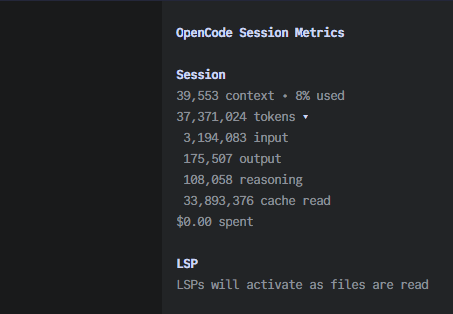

# OpenCode Session Metrics

Renders a live session token usage and cost in the TUI sidebar.
Includes subagents by usage default.



## Installation

1. Add the plugin to `tui.json`:

   ```json
   {
     "plugin": ["opencode-session-metrics"]
   }
   ```

2. Restart OpenCode.

## Configuration

The plugin can be customized by modifying its entry in `tui.json`.

```jsonc
{
  "plugin": [
    [
      "opencode-session-metrics",
      {
        // Whether to include token usage from subagents.
        "include_subagents": true,

        // Configure the plugin's context usage, hidden by default.
        "context": {
          "show": true,
          // Renders the usage text with warning color
          // when context % usage reaches this value
          "warn_on_usage": 80,
          // Renders the usage text with warning color
          // when tokens in context reaches this value
          "warn_on_count": 120_000,
        },
      },
    ],
  ],
  // If `context.show` is true, disable the built-in context panel.
  "plugin_enabled": {
    "internal:sidebar-context": false,
  },
}
```

## How It Works

Session Metrics reads assistant messages that contain token data and session
rollups. Its data source preference is:

1. HTTP messages
2. Loaded TUI messages
3. Session aggregates

It reports total tokens, input, output, reasoning, cache read/write tokens, and
cost. If OpenCode omits total, Session Metrics computes it as input + output +
reasoning; cache tokens remain separate. Values come from OpenCode and provider
integrations. Session Metrics does not estimate missing provider prices, change
messages, or persist credentials.

Fallback occurs when a request fails or returns no messages. A non-empty HTTP
response that is silently truncated can still produce incomplete totals. Long
sessions request a high message limit, but server or API limits can cause this.

## Development

These commands are for maintainers working from a source checkout. From this
package directory, allow about 2 minutes for validation:

```sh
npm install
npm run check
npm test
npm pack --dry-run
```

Inspect the dry-run contents before publishing. Publishing remains manual:

```sh
npm publish
```
