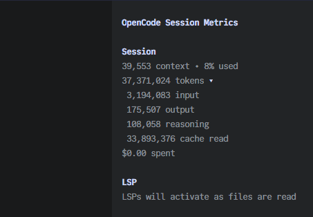

# OpenCode Session Metrics

Renders a live session token usage and cost in the TUI sidebar.
Includes subagents by usage default.



## Requirements

OpenCode `1.17.x–1.18.x` (`>=1.17.0 <1.19.0`).

## Installation

1. Add the plugin to `tui.json`:

   ```json
   {
     "plugin": ["opencode-session-metrics"]
   }
   ```

2. Restart OpenCode.

## Configuration

The plugin can be customized by modifying its entry in `tui.json`.

```jsonc
{
  "plugin": [
    [
      "opencode-session-metrics",
      {
        // Whether to include token usage from subagents.
        "include_subagents": true,

        // Configure the plugin's context usage, hidden by default.
        "context": {
          "show": true,
          // Renders the usage text with warning color
          // when context % usage reaches this value
          "warn_on_usage": 80,
          // Renders the usage text with warning color
          // when tokens in context reaches this value
          "warn_on_count": 120_000,
        },
      },
    ],
  ],
  // If `context.show` is true, disable the built-in context panel.
  "plugin_enabled": {
    "internal:sidebar-context": false,
  },
}
```

## How It Works

- **Sources:** Prefers HTTP assistant messages, then loaded TUI messages, then
  session rollups. Subagents are included by default and can be controlled with
  `include_subagents`.
- **Metrics:** Reports total, input, output, reasoning, cache read/write tokens,
  and cost. If total is missing, it is derived as input + output + reasoning;
  cache tokens remain separate.
- **Cost:** Uses reported message cost; a zero cost is estimated from an exact
  `providerID/modelID` pricing match, preferring runtime pricing over local
  `models.json`.
- **Privacy:** The local fallback makes no network calls, touches no
  credentials, and does not alter messages.
- **Limitations:** Failed or empty requests fall back to the next source. A
  non-empty HTTP response that is silently truncated can still undercount.

## Development

These commands are for maintainers working from a source checkout. Bun is the
package manager, build tool, and test runner:

```sh
bun install
bun run check
bun test
bun run build
bun pm pack --dry-run
```

Local testing imports the TypeScript source directly, so it does not require a
build. For example, use this in a local OpenCode configuration:

```json
{
  "plugin": ["./plugins/session-metrics/src/plugin.tsx"]
}
```

An installed npm package instead uses its compiled `dist/plugin.js` export.
Inspect the dry-run contents before a release. Release-please automatically
publishes releases created by the workflow. Use `bun publish` only for manual
recovery or to reproduce a release:

```sh
bun publish --access public
```
